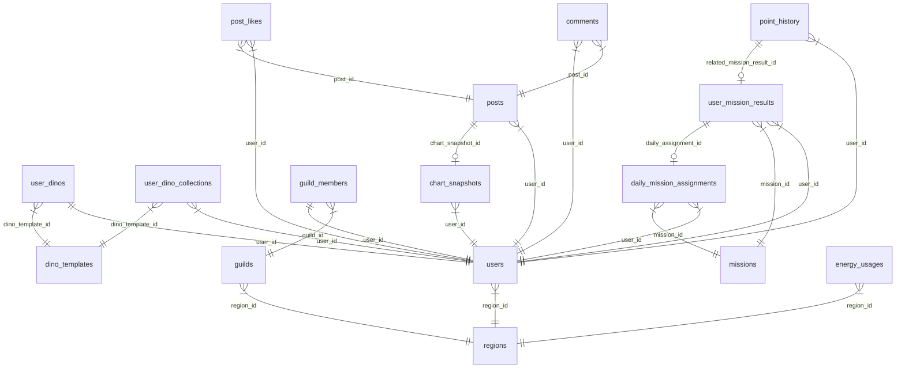

# 🦖 EcoVision: Dino Revival
> **지자체별 실시간 에너지 데이터 분석 시각화와 실시간 전력망 연계형 공룡 육성 게이미피케이션이 결합된 친환경 웹 플랫폼**

<p align="center">
  
  
  
  
  
  
</p>

---

## 📁 프로젝트 소개 (Overview)
**EcoVision: Dino Revival**은 기후 변화 대응과 일상 속 탄소 중립 실천을 유도하기 위한 웹 플랫폼입니다.  
공공 데이터 포털의 지자체별 실제 에너지 소비 통계를 다차원으로 시각화 분석하는 **대시보드** 기능과, 사용자가 일상 탄소 감축 미션 및 퀴즈를 수행하여 획득한 포인트로 반려 공룡을 성장시키는 **게이미피케이션** 요소를 유기적으로 연결했습니다. 

특히, 전력망의 실시간 탄소집약도(Carbon Intensity)에 따라 미션 보상이 변동되고 공룡 성장 상태가 다르게 진화하는 **실시간 탄소 시계 시스템**을 도입하여 환경 보호에 대한 몰입도를 향상시켰습니다.

---

## 🛠️ 기술 스택 (Tech Stack)

### **Frontend**
* **Framework**: React 18+ (Vite) / TypeScript
* **State Management**: Zustand (경량 전역 상태 관리 및 로컬 저장소 동기화)
* **Visualization**: Recharts (동적 막대/선 비교 차트 및 순차 솟아오름 애니메이션)
* **Aesthetics**: Vanilla CSS (Sage & Cream 오가닉 친환경 컬러 시스템 테마 적용)
* **Image Processing**: React-easy-crop (회원가입/마이페이지 내 슬라이더 조절식 아바타 이미지 크롭기)

### **Backend**
* **Framework**: Java 17 / Spring Boot 3.x
* **Security**: Spring Security / JWT (Access & Redis 기반 Refresh Token 무효화)
* **Data Access**: Spring Data JPA / QueryDSL (검색 조건 복합 필터 동적 쿼리)
* **DB Migration**: Flyway (버전 제어 데이터베이스 형상 관리)
* **Resilience**: Resilience4j (외부 API 장애 대응 서킷 브레이커 & Fallback 모의 데이터 적재)
* **Scheduling**: ShedLock (분산 서버 스케줄러 중복 락 제어)
* **XSS Prevention**: Jsoup (HTML 화이트리스트 기반 WYSIWYG 에디터 스크립트 필터링)

---

## 🧬 시스템 구조도 (System Architecture)

```text
                                [ Web Browser (React App) ]
                                            │
                      ┌─────────────────────┴─────────────────────┐
                      ▼ (Port 80)                                 ▼ (Port 8080)
             [ Nginx Web Server ]                        [ Spring Boot API Server ]
                      │                                           │
         (Serves Static Files from                        ├───────────────────────┤
             frontend/dist)                               ▼                       ▼
                                                      [ MySQL 8.0 ]           [ Redis ]
                                                     (RDBMS Core)        (Refresh Tokens &
                                                                           ShedLock Locks)
```

---

## 🌟 주요 화면 및 서비스 기능

### **1. 실시간 탄소 시계 및 지자체 대시보드**
* **실시간 탄소집약도 위젯**: 기상청 및 전력거래소 실시간 데이터를 활용해 현재 전력망의 청정도 상태(정화됨 / 보통 / 오염됨)를 표출합니다.
* **지자체 다차원 에너지 시각화**: 전국 및 지자체별 연간/월간 전력 사용량 및 이산화탄소 배출량을 Recharts 그래프로 가공하여 동적으로 렌더링합니다.
* **다중 차트 비교 분석**: 최대 5개 지자체의 에너지 사용 추이를 하나의 Line/Bar 차트에서 비교 분석할 수 있습니다.
* **차트 스냅샷 영구 보관**: 분석 완료된 복합 차트 상태를 내 보관함에 고유 UUID 스냅샷 형태로 저장하거나 공유 링크로 외부에 발행합니다.

### **2. 반려 공룡 육성 (게이미피케이션)**
* **실시간 상태 연동**: 사용자는 최초 가입 온보딩 시 무작위 알 단계의 반려 공룡을 선택합니다.
* **성장 단계 진화**: 일상 미션 완료와 퀴즈 풀이로 친밀도 및 경험치(EXP)를 획득하여 알(EGG) ➡️ 유아기(HATCHLING) ➡️ 청소년기(JUVENILE) ➡️ 성체(ADULT)로 진화합니다. 
* **스냅샷 박제**: 커뮤니티 게시글 등록 시점의 공룡 레벨 및 외형 상태가 JSON 메타데이터로 박제되어 게시글 내 공룡 카드로 함께 렌더링됩니다.

### **3. 탄소 감축 데일리 & 던전 미션**
* **실시간 가중치 기반 보상**: 미션 완료 시점의 실시간 전력망 가중치(Carbon Weight)와 던전 활성화 배율이 동적으로 곱해져 보상 포인트가 차등 지급됩니다.
* **일일 포인트 획득 상한선(350점) 제어**: 무분별한 어뷰징 및 어택을 방지하기 위해 일일 미션으로 획득 가능한 포인트의 상한선을 필터링하고 제한 이력을 데이터베이스에 기록합니다.

### **4. 보태니컬 에디터 및 커뮤니티**
* **리치 WYSIWYG 에디터**: 2층 Sub Toolbar(글자 크기, 형광펜, 표 그리기, 인용구 블록) 및 이미지 실시간 드래그 리사이징 핸들러 지원.
* **차트 인라인 React Portal 렌더링**: 에디터 본문 내에 삽입된 공유 차트 주소(`/embed/{uuid}`)를 분석하여 텍스트 상단에 실제 차트 컴포넌트를 동적으로 마운트하여 실시간 인라인 렌더링합니다.
* **자가 치유(Self-Healing) 파서**: 백엔드 Jsoup 보안 검사 과정에서 `data-uuid` 등의 속성이 걸러지더라도 렌더링 시점에 링크 주소로부터 UUID를 역추출하여 차트를 복구해내는 탄탄한 렌더러를 탑재했습니다.

---

## 🧬 ERD (Entity-Relationship Diagram)



---

## 🔍 테이블 세부 명세서 (Database Schema Specifications)

<details>
<summary>📂 데이터베이스 테이블 상세 명세서 보기</summary>

### 1. `users` (회원 정보)
사용자 핵심 인증 및 게이미피케이션 요약 데이터를 담고 있는 테이블입니다.
| 컬럼명 | 타입 | Key | Null | 설명 |
| :--- | :--- | :---: | :---: | :--- |
| `id` | BIGINT | PK | N | 사용자 고유 식별자 (Auto-Increment) |
| `email` | VARCHAR(100) | UK | N | 로그인 용도 고유 이메일 ID |
| `password` | VARCHAR(255) | - | N | BCrypt 암호화 처리된 비밀번호 |
| `nickname` | VARCHAR(50) | UK | Y | 사용자 닉네임 (중복 불가) |
| `avatar_url` | MEDIUMTEXT | - | Y | 크롭된 아바타 프로필 이미지 (Base64) |
| `region_id` | BIGINT | FK | Y | 소속 행정구역 ID (`regions.id` 외래키) |
| `role` | VARCHAR(20) | - | N | 권한 등급 (`USER`, `ADMIN`) |
| `total_points` | INT | - | N | 누적 획득 전체 포인트 |
| `ranking_point` | INT | - | N | 현재 시즌 랭킹 점수 요약값 |
| `today_points_accumulated` | INT | - | N | 당일 미션으로 획득한 누적 보상 포인트 (일일 상한 350점 필터링용) |
| `last_point_accumulated_date` | DATE | - | Y | 마지막 포인트 획득 일자 |
| `saved_carbon_kg` | DECIMAL(12,3) | - | N | 누적 온실가스 탄소 절감량(kgCO2eq) |
| `last_nickname_changed_at` | TIMESTAMP | - | Y | 마지막 닉네임 변경 시간 (30일 변경 제한용) |
| `last_region_changed_at` | TIMESTAMP | - | Y | 마지막 지역 변경 시간 (30일 변경 제한용) |
| `created_at` | TIMESTAMP | - | N | 계정 가입 일시 |
| `updated_at` | TIMESTAMP | - | N | 계정 정보 최근 수정 일시 |
| `deleted_at` | TIMESTAMP | - | Y | 탈퇴 시점 기록 |

### 2. `regions` (행정구역 정보)
대한민국 표준 행정동 및 법정구역 정보 테이블입니다.
| 컬럼명 | 타입 | Key | Null | 설명 |
| :--- | :--- | :---: | :---: | :--- |
| `id` | BIGINT | PK | N | 지역 고유 ID (Auto-Increment) |
| `sido` | VARCHAR(50) | - | N | 광역지자체 (시/도) |
| `sigungu` | VARCHAR(50) | - | N | 기초지자체 (시/군/구) |
| `dong` | VARCHAR(50) | - | Y | 행정동 명칭 |
| `region_code` | VARCHAR(20) | UK | N | 행정동/구역 코드 (10자리) |
| `created_at` | TIMESTAMP | - | N | 정보 등록 시간 |

### 3. `dino_templates` (공룡 종류 마스터)
키울 수 있는 반려 공룡의 종류 및 성장 단계별 이미지 경로 마스터 테이블입니다.
| 컬럼명 | 타입 | Key | Null | 설명 |
| :--- | :--- | :---: | :---: | :--- |
| `id` | BIGINT | PK | N | 템플릿 고유 식별자 |
| `dino_code` | VARCHAR(50) | UK | N | 공룡 코드 (예: `TYRANO`, `SAURO`, `CERATO`) |
| `dino_name` | VARCHAR(100) | - | N | 공룡 대표 종 이름 |
| `description` | VARCHAR(500) | - | Y | 종 특성 설명 |
| `egg_image_url` | VARCHAR(255) | - | Y | 알(EGG) 단계 이미지 주소 |
| `hatchling_image_url` | VARCHAR(255) | - | Y | 유아기(HATCHLING) 단계 이미지 주소 |
| `juvenile_image_url` | VARCHAR(255) | - | Y | 청소년기(JUVENILE) 단계 이미지 주소 |
| `adult_image_url` | VARCHAR(255) | - | Y | 성체(ADULT) 단계 이미지 주소 |

### 4. `user_dinos` (사용자 반려 공룡)
사용자당 1마리씩 보유하고 실시간 육성하는 공룡 상태 기록 테이블입니다.
| 컬럼명 | 타입 | Key | Null | 설명 |
| :--- | :--- | :---: | :---: | :--- |
| `id` | BIGINT | PK | N | 소유 공룡 고유 식별자 |
| `user_id` | BIGINT | FK, UK | N | 소유 사용자 ID (`users.id` 외래키, 1:1 관계) |
| `dino_template_id` | BIGINT | FK | N | 적용중인 공룡 마스터 ID (`dino_templates.id` 외래키) |
| `nickname` | VARCHAR(50) | - | Y | 공룡 애칭 |
| `stage` | VARCHAR(30) | - | N | 현재 성장 단계 (`EGG`, `HATCHLING`, `JUVENILE`, `ADULT`) |
| `exp` | INT | - | N | 현재 성장 경험치 (EXP) |
| `affinity` | INT | - | N | 현재 친밀도 (최대 100) |
| `evolved_at` | TIMESTAMP | - | Y | 최근 진화 완료 시점 |
| `created_at` | TIMESTAMP | - | N | 탄생(알 배정) 일시 |

### 5. `user_dino_collections` (공룡 도감 해금 기록)
사용자가 해금한 공룡 도감 매핑 정보 테이블입니다.
| 컬럼명 | 타입 | Key | Null | 설명 |
| :--- | :--- | :---: | :---: | :--- |
| `id` | BIGINT | PK | N | 기록 식별자 |
| `user_id` | BIGINT | FK | N | 해금한 사용자 ID |
| `dino_template_id` | BIGINT | FK | N | 해금된 공룡 템플릿 ID |
| `unlocked_at` | TIMESTAMP | - | N | 도감 해금 시간 |

### 6. `missions` (미션 기본 정보 마스터)
사용자가 참여할 수 있는 실천 미션 정보 테이블입니다.
| 컬럼명 | 타입 | Key | Null | 설명 |
| :--- | :--- | :---: | :---: | :--- |
| `id` | BIGINT | PK | N | 미션 고유 식별자 |
| `mission_code` | VARCHAR(80) | UK | N | 미션 코드 |
| `mission_name` | VARCHAR(150) | - | N | 미션 타이틀 명 |
| `category` | VARCHAR(50) | - | N | 카테고리 (`ENERGY`, `RESOURCE`, `WASTE` 등) |
| `slot_type` | VARCHAR(30) | - | N | 배정 시간대 (`DAY` 오전, `EVENING` 저녁, `ANYTIME` 상시) |
| `mission_type` | VARCHAR(30) | - | N | 구분 (`DAILY`, `DUNGEON`, `ONBOARDING`) |
| `base_reward` | INT | - | N | 기본 획득 포인트 (기본값: 20점) |
| `proof_type` | VARCHAR(30) | - | N | 인증방식 (`SELF_REPORT` 자가 신고, `PHOTO` 사진인증 등) |
| `is_repeatable` | BOOLEAN | - | N | 반복 수행 가능 여부 |
| `is_active` | BOOLEAN | - | N | 활성화 여부 |

### 7. `daily_mission_assignments` (일일 미션 사용자 배정 내역)
매일 새벽 스케줄러를 통해 사용자별 슬롯에 무작위 배정되는 일일 미션 인스턴스 테이블입니다.
| 컬럼명 | 타입 | Key | Null | 설명 |
| :--- | :--- | :---: | :---: | :--- |
| `id` | BIGINT | PK | N | 배정 식별자 |
| `user_id` | BIGINT | FK | N | 배정된 사용자 ID |
| `mission_id` | BIGINT | FK | N | 배정된 미션 ID |
| `assigned_date` | DATE | - | N | 미션 배정 일자 |
| `slot_type` | VARCHAR(30) | - | N | 배정된 슬롯 타입 (`DAY`, `EVENING`, `ANYTIME`) |
| `status` | VARCHAR(30) | - | N | 진행 상태 (`ASSIGNED`, `COMPLETED`, `EXPIRED`) |

### 8. `carbon_intensity_logs` (실시간 전력망 탄소집약도 로그)
실시간 탄소 시계 위젯의 기준이 되는 로그 테이블입니다.
| 컬럼명 | 타입 | Key | Null | 설명 |
| :--- | :--- | :---: | :---: | :--- |
| `id` | BIGINT | PK | N | 로그 식별자 |
| `measured_at` | TIMESTAMP | - | N | 계측 시간 |
| `carbon_intensity` | DECIMAL(10,3) | - | N | 탄소집약도 계측값 (gCO2/kWh) |
| `status` | VARCHAR(30) | - | N | 등급 상태 (`PURIFIED` 정화, `NORMAL` 보통, `POLLUTED` 오염) |
| `carbon_weight` | DECIMAL(4,2) | - | N | 실시간 보상 계산 가중치 배율 (`1.00`, `1.20`, `1.50`) |
| `reserve_rate` | DECIMAL(6,2) | - | Y | 전력 예비율 (%) |
| `power_mix_json` | JSON | - | Y | 발전원별 발전 비중 메타데이터 (석탄, 원자력, 태양광 등) |

### 9. `chart_snapshots` (대시보드 공유 차트 스냅샷)
대시보드 시각화 결과를 커뮤니티에 기재하기 위한 UUID 기반 복합 메타데이터 테이블입니다.
| 컬럼명 | 타입 | Key | Null | 설명 |
| :--- | :--- | :---: | :---: | :--- |
| `id` | VARCHAR(36) | PK | N | 고유 UUID 식별자 |
| `user_id` | BIGINT | FK | Y | 작성 사용자 ID (비로그인 공유 시 NULL 가능) |
| `title` | VARCHAR(200) | - | Y | 차트 스냅샷 명칭 (보관용) |
| `chart_type` | VARCHAR(50) | - | Y | 그래프 형태 (`LINE`, `BAR`) |
| `chart_metadata` | JSON | - | N | 저장 당시의 필터 구성 및 시뮬레이션 지자체 데이터 셋 정보 |
| `created_at` | TIMESTAMP | - | N | 생성 시간 |

### 10. `posts` (커뮤니티 게시글)
에디터 서식 및 스냅샷/공룡 포탈을 담는 커뮤니티 게시글 테이블입니다.
| 컬럼명 | 타입 | Key | Null | 설명 |
| :--- | :--- | :---: | :---: | :--- |
| `id` | BIGINT | PK | N | 게시글 고유 식별자 |
| `user_id` | BIGINT | FK | N | 작성자 ID |
| `category` | VARCHAR(30) | - | N | 게시판 분류 (`NOTICE` 공지, `GENERAL` 자유, `INFO_SHARE` 정보공유) |
| `title` | VARCHAR(200) | - | N | 글 제목 |
| `content` | TEXT | - | N | 에디터로 작성된 HTML 내용 본문 |
| `chart_snapshot_id` | VARCHAR(36) | FK | Y | 대표 첨부된 공유 차트 스냅샷 ID (`chart_snapshots.id` 외래키) |
| `dino_snapshot` | JSON | - | Y | 작성 시점의 사용자 반려 공룡 성장 메타데이터 스냅샷 |
| `view_count` | INT | - | N | 조회수 |
| `like_count` | INT | - | N | 추천수 (연타 방지 및 동시성 덮어쓰기 쿼리 반영 필드) |
| `created_at` | TIMESTAMP | - | N | 최초 작성 일시 |
| `updated_at` | TIMESTAMP | - | N | 최종 수정 일시 |
| `deleted_at` | TIMESTAMP | - | Y | 삭제 시 삭제일자 대입 (Soft Delete) |

### 11. `post_likes` (게시글 추천 실매핑 테이블)
중복 추천을 완벽히 방지하고 추천 로우를 세는 매핑 테이블입니다.
| 컬럼명 | 타입 | Key | Null | 설명 |
| :--- | :--- | :---: | :---: | :--- |
| `id` | BIGINT | PK | N | 추천 식별자 |
| `user_id` | BIGINT | FK | N | 추천한 유저 ID |
| `post_id` | BIGINT | FK | N | 추천받은 게시글 ID |
| `created_at` | TIMESTAMP | - | N | 추천 일시 |
| *제약조건* | `uk_post_like_user_post` | UK | - | 한 사용자가 글당 1회만 누르도록 `(user_id, post_id)` 복합 유니크 키 지정 |

### 12. `energy_usages` (지역별 월간 전력 통계 마스터)
KEPCO / KECO API 및 Fallback을 통해 적재되어 대시보드 시각화의 근본이 되는 통계 테이블입니다.
| 컬럼명 | 타입 | Key | Null | 설명 |
| :--- | :--- | :---: | :---: | :--- |
| `id` | BIGINT | PK | N | 통계 레코드 식별자 |
| `region_id` | BIGINT | FK | Y | 관련 행정동 ID (`regions.id` 외래키) |
| `region_code` | VARCHAR(20) | - | N | 10자리 행정동 코드 (전국 조회용 `"1111000000"` 분기 지원) |
| `usage_year_month` | VARCHAR(6) | - | N | 사용 연월 (포맷: `YYYYMM`) |
| `energy_type` | VARCHAR(30) | - | N | 자원 구분 (`ELECTRICITY` 전기 고정) |
| `usage_amount` | DECIMAL(15,3) | - | N | 전력 사용량 (kWh) |
| `usage_unit` | VARCHAR(30) | - | Y | 단위 (`kWh`) |
| `carbon_emission_kg` | DECIMAL(15,3) | - | Y | 탄소 배출 환산량 (kgCO2eq) |
| `source_name` | VARCHAR(255) | - | Y | 출처 기관명 (`KEPCO`) |
| `created_at` | TIMESTAMP | - | N | 데이터 수집 시간 |

</details>

---

## 🚀 실행 및 로컬 구동 방법 (Run Guide)

### **1. 데이터베이스 및 캐시 컨테이너 구동 (Docker)**
프로젝트 루트 경로에서 Docker Compose 데몬을 백그라운드로 켭니다.
```bash
docker-compose up -d
```
* **데이터 적재**: 컨테이너가 켜질 때 `database/schema.sql`과 `database/data.sql`을 읽어서 초기 테이블 및 미션 마스터, 공룡 템플릿 마스터 데이터를 자동으로 구성합니다.

### **2. 백엔드 API 서버 구동 (Spring Boot)**
```bash
cd backend
# Windows Environment
.\gradlew bootRun

# macOS / Linux / Bash Environment
./gradlew bootRun
```
* **Flyway 동기화**: 서버 실행과 동시에 `flyway_schema_history`를 스캔하여 락 테이블 및 포인트 이력 등 미반영된 마이그레이션 DDL을 자동 적용합니다.
* **백엔드 포트**: `http://localhost:8080`

### **3. 프론트엔드 웹 앱 구동 (Vite)**
```bash
cd frontend
npm install   # 최초 구동 시 의존 패키지 다운로드
npm run dev   # 로컬 개발 서버 구동
```
* **접속 주소**: 브라우저창에 `http://localhost:5173` 을 입력하여 접속합니다.
